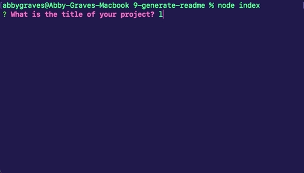

# Node.js Challenge: Professional README Generator

## **Description**
A command-line application that dynamically generates a professional READEME.md file containing the user's input.

 

## **Built With:**
+ javascript
+ node.js
+ inquirer npm package 

 

## **What I Did**
+ Installed and implemented the inquier npm package
+ Provided questions/prompts for the user to answer 
+ Used the user input to fill out and generate a README.md file
+ Created a README.md template with hardcoded elements such as section titles and formatting
+ Enabled the app to dispaly a badge for the selected license 

 

## **Credit**
Inquirer npm package:
[https://www.npmjs.com/package/inquirer](https://www.npmjs.com/package/inquirer)

 

